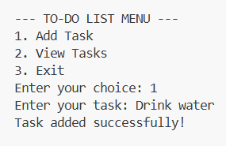
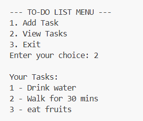

# 📝 To-Do List App (Python)

This project is built as part of **Python Internship Project 1**.

The main goal is to understand how to store and manage multiple tasks using Python lists and basic logic.

---

## 🚀 Features

* Add tasks
* View tasks
* Save tasks using JSON file
* Simple command-line interface

---

## 📂 Project Structure

```
todo-list-python/
│── main.py
│── tasks.json
│── README.md
```

---

## ▶️ How to Run

```bash
python main.py
```

---

## 🖥️ Screenshots

### 📌 Menu

```
--- TO-DO LIST MENU ---
1. Add Task
2. View Tasks
3. Exit
```


---

### 📌 Add Task

```
Enter your task: Study Python
Task added successfully!
```



---

### 📌 View Tasks

```
Your Tasks:
1 - Study Python
2 - Buy Milk
```



---

## 🧠 Concepts Used

### 🔹 List (Data Storage)

```python
my_tasks = []
```

Used to store multiple tasks in one variable.

---

### 🔹 Append (Add Task)

```python
my_tasks.append(task)
```

Used to add new tasks to the list.

---

### 🔹 Loop (Display Tasks)

```python
for i, task in enumerate(my_tasks, start=1):
```

Used to display all tasks with numbering.

---

### 🔹 IPO Model

* Input → `input()`
* Process → `append()`
* Output → `print()`

---

### 🔹 Data Persistence (JSON)

```python
json.dump(my_tasks, file)
```

Used to save tasks so they are not lost after closing the program.

---

### 🔹 Entry Point

```python
if __name__ == "__main__":
```

Ensures the program runs correctly.

---

## 💡 Learning Outcome

* Learned how lists work like a simple database
* Understood how to add and display data
* Learned basic file handling using JSON
* Applied Input → Process → Output logic

---

## 👨‍💻 Author

Your Name
